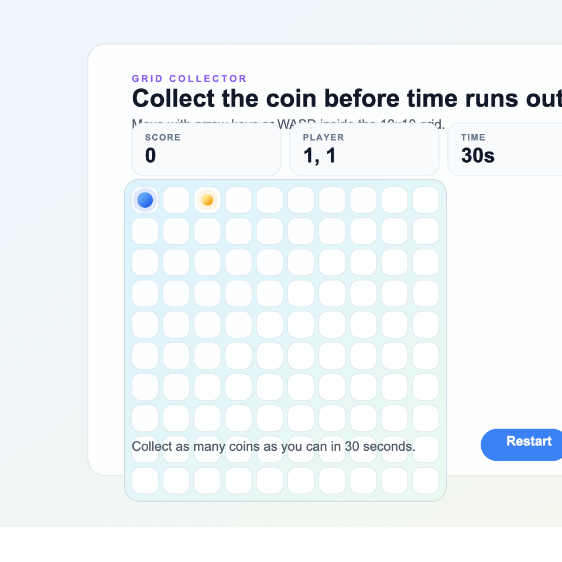

# AI Adoption Game

A small browser game built with React, TypeScript, Vite, and an optional tiny Node + SQLite API for local persistence. The current playable build supports two arcade modes on the same 10x10 grid: a timed score-attack mode and a coin-race mode with an instant-loss obstacle.



This document covers:

- what the game currently does
- how record persistence works
- how the code is structured
- how to run and test it
- current limitations
- recommended next steps

## Current Status

There are still two layers to the project:

- Current implementation: a fully playable arcade MVP presented in the UI as `Grid Collector`
- Planned direction: an `AI Adoption Game` theme described in the planning documents

The shipped code is no longer the original single-mode collector game. It now has:

- `Time mode`
- `Coin mode`
- a persistent obstacle hazard
- SQLite-backed per-mode records
- extracted game rules in `src/game.ts`

The AI-adoption framing is still mostly a product direction rather than implemented gameplay.

## Product Summary

The current loop is intentionally simple:

- The player starts in the top-left cell.
- The player chooses between `Time mode` and `Coin mode`.
- Each round places one coin and one obstacle on valid cells.
- The player moves with arrow keys or `WASD`.
- Collecting a coin increases the score by `1`.
- After each coin capture, both the next coin and the obstacle respawn into new valid cells.
- Touching the obstacle ends the run immediately as a loss.
- `Time mode` ends when the selected timer reaches `0`.
- `Coin mode` ends when the player collects the selected coin target.
- The player can restart at any time.

This is still a strong interview MVP because it demonstrates:

- explicit game state
- keyboard interaction
- timer-based gameplay
- deterministic movement rules
- mode-specific win/loss conditions
- backend-backed persistence with a very small server

## Persistence

Successful completed runs are stored with two persistence paths:

- Local server mode:
  - The backend creates `data/game.db` automatically.
  - Records are read from `/api/records`.
  - Successful results are posted to `/api/records`.
- Static hosting mode:
  - If `/api/records` is unavailable, the frontend falls back to browser `localStorage`.
  - This keeps GitHub Pages playable without a backend, but records are per-browser rather than shared.

- `Time mode` stores the highest score for the selected round duration.
- `Coin mode` stores the lowest completion time for the selected coin target.
- Lost runs are not saved.
- If an older `scores` table exists, the backend migrates it into the new record format for time mode.

The server still exposes `/api/high-score` and `/api/scores` for compatibility, but the current frontend uses `/api/records`.

## Current Gameplay Rules

### Board

- Grid size: `10 x 10`
- Total cells: `100`
- Player start position: row `0`, column `0`
- One obstacle exists at all times during a round
- The coin never overlaps the player or obstacle

### Modes

`Time mode`

- Supports `15`, `30`, `45`, or `60` seconds
- Score increases by collecting coins
- The run ends when time reaches `0`
- Best record is the highest score for the selected duration

`Coin mode`

- Tracks `elapsedTime` instead of a countdown
- The run ends when the player reaches the selected coin target
- Best record is the lowest completion time for the selected target

### Movement

- Supported inputs:
  - `ArrowUp`, `ArrowDown`, `ArrowLeft`, `ArrowRight`
  - `W`, `A`, `S`, `D`
- Movement is clamped to the board boundaries.
- Invalid keys do nothing.
- Movement is disabled unless the round is in the `playing` phase.

### Hazard

- One obstacle token is placed each round.
- After each coin capture, the obstacle relocates before the next move.
- Touching it ends the run immediately with a loss.

### Restart

Restarting or starting a fresh round resets:

- player position
- score
- remaining time
- elapsed time
- coin position
- obstacle position
- pending record submission state

## UI Overview

The app is a single screen with these main areas:

1. Header copy
2. Mode selector
3. Status bar
4. Game board
5. Footer message and primary action button

### Status Bar

The status bar shows:

- current score or coin count
- best record for the selected mode and current mode setting
- current player coordinates
- time left or elapsed time, depending on mode

### Board Rendering

The board is rendered as a flat array of `100` cells. For each index:

- the row is `Math.floor(index / GRID_SIZE)`
- the column is `index % GRID_SIZE`
- the cell can render:
  - a coin token
  - an obstacle token
  - a player token

### Visual Style

The current UI uses:

- a light gradient page background
- a centered card layout
- a mode selector for pre-game setup
- simple circular tokens for coin, obstacle, and player
- responsive stacking on smaller screens

## Code Structure

The app is organized as a minimal frontend plus a small local backend:

```text
src/
  App.tsx       main game logic and UI
  App.css       game-specific styles
  game.ts       constants, types, and pure game helpers
  records.ts    backend-first records access with localStorage fallback
  index.css     global styles
  main.tsx      React entry point
server/
  server.mjs    SQLite API + static file server
  dev.mjs       one-command local dev runner
data/
  .gitkeep      keeps the directory in git
  game.db       created automatically on first backend run
```

### `src/game.ts`

This file now owns the reusable game rules and types. It contains:

- constants such as `GRID_SIZE`, `DEFAULT_TIME_MODE_SECONDS`, and `DEFAULT_COIN_MODE_TARGET`
- `Position`, `GameMode`, `GamePhase`, `RecordQuery`, and `PersistedRecord`
- `positionsEqual`
- `movePlayer`
- `getRandomAvailablePosition`
- `createRoundLayout`

These helpers are pure and are the best place to start when adding tests.

### `src/App.tsx`

This is the main UI coordinator. It contains:

- mode selection
- game phases (`ready`, `playing`, `timeUp`, `won`, `lost`)
- record fetching and submission through `src/records.ts`
- timer lifecycle
- keyboard handling
- round reset/start behavior
- board rendering and footer messaging

### `src/records.ts`

Responsible for:

- fetching best records from `/api/records` when available
- saving successful runs to `/api/records` when available
- falling back to browser `localStorage` when the API is unavailable
- keeping the Pages deployment playable without any backend

### `server/server.mjs`

Responsible for:

- creating the SQLite database and `score_records` table
- migrating legacy `scores` rows when present
- returning current best records
- saving successful run records
- serving the built frontend with the API when using `npm run start`

## GitHub Pages

This repo can deploy the frontend as a static GitHub Pages site.

- The workflow lives at `.github/workflows/deploy-pages.yml`.
- It builds the app with `PAGES_BASE_PATH=/ai-adoption-game/`.
- Static deployments use browser `localStorage` for records because GitHub Pages cannot run the Node + SQLite server.

If the repository name changes, update the `PAGES_BASE_PATH` value in the workflow.

## Technical Decisions

The current implementation still favors simplicity over abstraction:

- Single-screen app
- No external state library
- No router
- Tiny local backend
- SQLite persistence
- Extracted pure rules in `src/game.ts`
- No custom hooks yet
- No test suite yet

This is appropriate for the current scope and interview constraints.

## How To Run

### Runtime requirement

Use Node `22.12.0` or newer. The backend depends on the built-in `node:sqlite` module, and the repo pins `22.12.0` in [`.nvmrc`](./.nvmrc).

### Install

```bash
npm install
```

### Start the dev server

```bash
npm run dev
```

This starts both:

- the Vite frontend on `http://localhost:5173`
- the local API on `http://localhost:3001`

Then open the Vite URL in the browser.

### Production build

```bash
npm run build
```

### Run the built app with the local database

```bash
npm run start
```

Then open `http://localhost:3001`.

### Lint

```bash
npm run lint
```

## How To Play

1. Start the app.
2. Choose `Time mode` or `Coin mode`.
3. Adjust the mode-specific setting:
   - `Time mode`: choose how many seconds the round lasts
   - `Coin mode`: choose how many coins must be collected
4. Press `Start game`.
5. Move with arrow keys or `WASD`.
6. Avoid the obstacle tile.
7. Collect coins until the mode-specific end condition is reached.
8. Use `Restart` during a run or `Play again` after it ends.

## Manual Test Checklist

Use this checklist after gameplay changes:

1. Confirm the player starts in the top-left corner.
2. Confirm the coin never spawns on the player's current cell.
3. Confirm the obstacle never spawns on the player's current cell.
4. Confirm the coin never overlaps the obstacle.
5. Confirm arrow keys move exactly one cell.
6. Confirm `WASD` also move exactly one cell.
7. Confirm the player cannot move outside the board.
8. Confirm collecting a coin increments the score.
9. Confirm a new coin appears immediately after collection.
10. Confirm the obstacle also moves to a new valid cell after each collection.
11. Confirm the new coin and obstacle never overlap each other or the player.
12. Confirm touching the obstacle ends the run immediately.
13. Confirm `Time mode` counts down once per second and ends at `0`.
14. Confirm changing Time mode duration changes the countdown and the saved best lookup.
15. Confirm `Coin mode` counts elapsed time up once per second.
16. Confirm changing Coin mode target changes the win condition and the saved best lookup.
17. Confirm successful runs update the correct mode-specific best record.
18. Confirm lost runs do not update saved records.
19. Refresh the page and confirm records persist.

## Current Limitations

- No mobile touch controls
- No audio feedback
- No difficulty settings
- No combo, streak, or bonus scoring
- No dedicated modal/screen transitions beyond inline panel state
- Only one obstacle exists per run
- Best records are mode-specific only, not per-player
- No pause/resume
- No tests
- Most UI orchestration still lives in one component

There are still two product mismatches worth noting:

- The repository and docs use the name `AI Adoption Game`, but the live UI still presents a generic collector experience.
- The current theme is still visually generic rather than AI-adoption specific.

## Recommended Next Steps

### Phase 1: Stronger MVP

1. Leaderboard
   - Expand from single best records to ranked stored scores
   - Reuse the existing SQLite/API path

2. Touch controls
   - Add on-screen directional buttons
   - Makes the game playable on phones and tablets

3. Better feedback
   - Add collection animation
   - Add score pulse or timer warning states

4. Copy cleanup
   - Align the title, instructions, and theme with the actual mechanics

### Phase 2: Better Game Design

1. Multiple obstacles or difficulty presets
2. Moving coin or timed relocation
3. Bonus pickups
4. Combo system
5. Clearer win/loss presentation

### Phase 3: Theme Alignment

1. Re-theme coins into AI opportunities
2. Re-theme obstacles into adoption blockers
3. Add secondary resources such as trust or budget
4. Introduce themed events or objectives

## Suggested Refactor Plan

The main rules have already been extracted into `src/game.ts`. The next clean splits would likely be:

- `src/components/StatusBar.tsx`
- `src/components/Board.tsx`
- `src/components/ModeSelector.tsx`
- `src/components/Footer.tsx`

Only do this once the screen grows enough that `App.tsx` becomes harder to explain.

## Testing Strategy

When tests are added, start with pure rule tests first:

- movement boundaries
- unsupported key behavior
- coin and obstacle spawn validity
- score increase on collection
- timer edge conditions
- win/loss transitions by mode

After that, add a few UI tests for:

- keyboard interaction
- restart flow
- mode switching
- record submission behavior

Keep the first test pass small. The goal is confidence, not heavy infrastructure.

## Additional Planning

The repo already includes [FEATURE_PLAN.md](./FEATURE_PLAN.md), which contains extra theme and design ideas. A more structured delivery roadmap lives in [docs/ROADMAP.md](./docs/ROADMAP.md).

## Review Summary

Based on the current workspace state:

- The game now includes two modes, obstacle loss, extracted rules in [src/game.ts](/Users/pablorosa/Documents/practicas/ai-adoption-game/src/game.ts), and SQLite-backed mode records in [server/server.mjs](/Users/pablorosa/Documents/practicas/ai-adoption-game/server/server.mjs).
- The main documentation gap was that parts of the README still described the earlier single-mode implementation.
- The gameplay preview GIF remains relevant and is still referenced here.

This README now reflects the current implementation more accurately.
